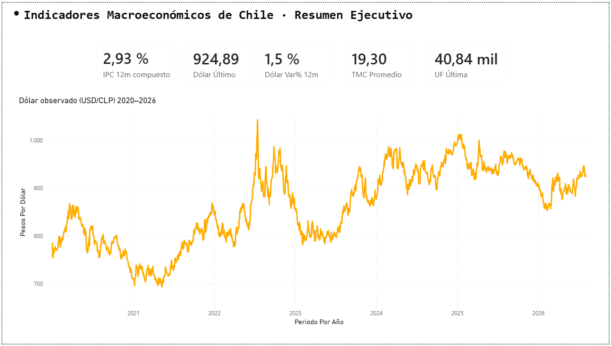
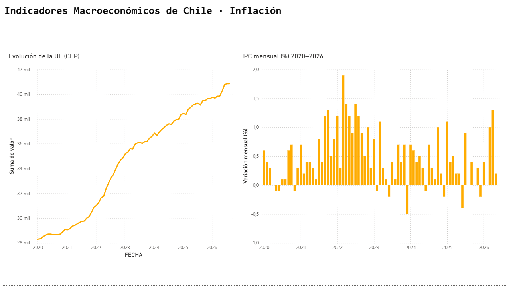
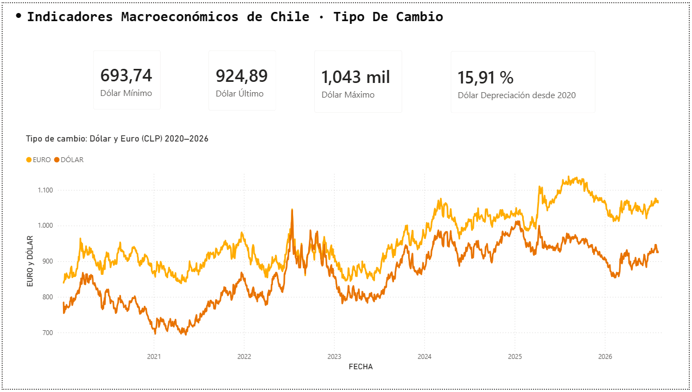
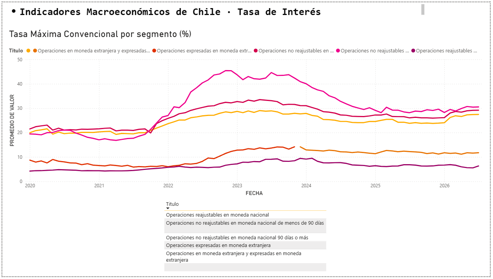

# Dashboard de Indicadores Macroeconómicos Chile (CMF)

Dashboard interactivo en Power BI con datos oficiales de la Comisión para el Mercado Financiero (CMF) de Chile.
Proyecto de portafolio orientado a cargos de **Data Analyst** en banca y fintech.

---

## Preguntas de negocio que responde

| # | Pregunta | Indicador |
|---|----------|-----------|
| 1 | ¿Cómo evolucionó la inflación en Chile (2020–2026)? | IPC mensual y acumulado anual |
| 2 | ¿Qué tan volátil ha sido el tipo de cambio? | USD/CLP y EUR/CLP diarios |
| 3 | ¿Cómo se relacionan la UF y el IPC? | Correlación UF vs inflación |
| 4 | ¿Cómo han variado las tasas de crédito? | TIP y TMC por segmento |
| 5 | ¿Cuánto ha perdido el peso frente al dólar en 5 años? | Depreciación acumulada |

---

## Stack tecnológico

| Capa | Herramienta |
|------|-------------|
| Extracción y limpieza | Python (`requests`, `pandas`) |
| Almacenamiento | CSV en `data/clean/` |
| Visualización | Power BI Desktop |
| Fuente de datos | API CMF Chile (`api.cmfchile.cl`) |

---

## Datos extraídos

| Archivo | Descripción | Frecuencia | Filas |
|---------|-------------|-----------|-------|
| `uf.csv` | Unidad de Fomento | Diaria | ~2.400 |
| `dolar.csv` | Tipo de cambio USD/CLP | Hábil diaria | ~1.600 |
| `euro.csv` | Tipo de cambio EUR/CLP | Hábil diaria | ~1.600 |
| `ipc.csv` | Índice de Precios al Consumidor | Mensual | ~78 |
| `utm.csv` | Unidad Tributaria Mensual | Mensual | ~80 |
| `tip.csv` | Tasa de Interés Promedio por segmento | Mensual | ~960 |
| `tmc.csv` | Tasa Máxima Convencional por segmento | Mensual | ~950 |

Período cubierto: **enero 2020 – agosto 2026**

---

## El dashboard

El archivo `dashboard/dashboard.pbix` contiene cuatro páginas interactivas.

### 1 · Resumen ejecutivo
Indicadores clave de un vistazo (dólar, IPC 12m, UF, TMC) y la evolución del tipo de cambio.



### 2 · Inflación
IPC mensual (con el pico inflacionario de 2022) y la UF, que acumula esa inflación de forma escalonada.



### 3 · Tipo de cambio
Dólar y euro frente al peso, con máximos, mínimos y depreciación acumulada.



### 4 · Tasas de interés
Tasa Máxima Convencional (TMC) por segmento, con segmentador para filtrar por tipo de operación.



---

## Estructura del repositorio

```
dashboard-financiero-cmf/
├── data/
│   ├── raw/          # JSON crudos de la API (no versionados)
│   └── clean/        # CSVs limpios para Power BI
├── notebooks/
│   └── 01_extraccion_cmf.ipynb   # extracción + limpieza documentada
├── src/
│   ├── extraccion.py             # módulo reutilizable de extracción
│   └── calendario.py             # genera la tabla calendario del modelo
├── dashboard/
│   ├── dashboard.pbix            # entregable Power BI
│   ├── medidas_dax.md            # medidas DAX documentadas
│   ├── guia_dashboard.md         # guía de construcción del dashboard
│   └── pagina*.png               # capturas de las 4 páginas
├── .env.example                  # plantilla de API Key
├── requirements.txt
└── README.md
```

---

## Cómo reproducir

### 1 · Clonar el repositorio

```bash
git clone https://github.com/Mersen-cloud/dashboard-financiero-cmf.git
cd dashboard-financiero-cmf
```

### 2 · Entorno virtual e instalación

```bash
python -m venv .venv
.venv\Scripts\activate        # Windows
pip install -r requirements.txt
```

### 3 · Configurar API Key

Obtén tu clave gratuita en [api.cmfchile.cl](https://api.cmfchile.cl/) y crea el archivo `.env`:

```bash
copy .env.example .env
# Edita .env y reemplaza tu_api_key_aqui
```

### 4 · Ejecutar la extracción

```bash
python src/extraccion.py
```

Los archivos limpios quedan en `data/clean/` listos para cargar en Power BI.

---

## Hallazgos clave

1. **El peso se depreció 15,9% frente al dólar** entre enero 2020 y agosto 2026. El
   dólar se movió en un rango amplio: mínimo de **694** (2021) y máximo de **1.043**
   (2022), cerrando en **925**.

2. **La inflación tuvo su peak en marzo 2022 con 1,9% mensual.** Sumando los doce
   meses de 2022, el IPC acumuló **12,2%** en ese año, muy por encima de la meta de
   3% del Banco Central.

3. **La UF creció 44,3%** en el período (de **28.311** a **40.845**). Como se reajusta
   por el IPC, su curva ascendente casi continua es el espejo acumulado de la
   inflación: mientras el IPC mensual sube y baja, la UF solo crece.

4. **La política monetaria se ve en las tasas de crédito.** La TMC de operaciones no
   reajustables a 90+ días llegó a **43%** en el ciclo de alza 2022–2023 y luego
   descendió a ~**29%**, siguiendo el mismo patrón que la inflación con cierto rezago.

5. **El euro se apreció más que el dólar frente al peso**, alcanzando un máximo de
   **1.139** y cerrando en **1.065**. Se mantuvo por encima del dólar casi todo el
   período, con una excepción notable: entre fines de agosto y comienzos de noviembre
   de 2022, el episodio global de paridad euro-dólar hizo que el euro cotizara por
   debajo del dólar también en Chile.

> *Nota de calidad de datos:* la serie TIP incluye un valor atípico de 300% en junio
> 2025 para un tramo de microcrédito específico; se conserva tal como lo entrega la
> API para no alterar la fuente oficial.

---

## Fuente de datos

- **API CMF Chile**: [api.cmfchile.cl](https://api.cmfchile.cl/) — datos oficiales, acceso gratuito con registro.
- Los JSON crudos (`data/raw/`) no se versionan; solo el código y los CSVs limpios.

---

*Autor: Diego León · [GitHub: Mersen-cloud](https://github.com/Mersen-cloud)*
